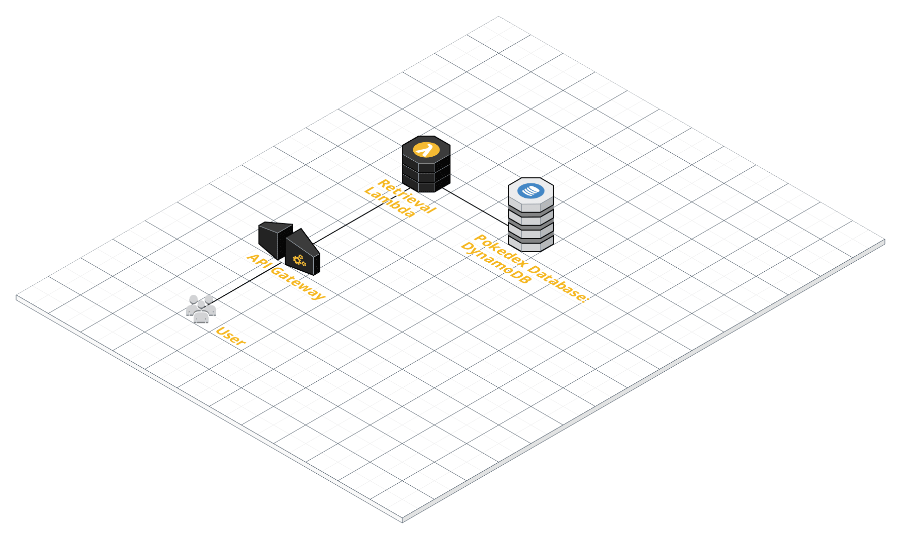

# Pokedex-API
This is a full stack Pokedex application that displays a search bar and profile for the current Pokemon.

# Pokedex Search and Pokemon Profile
Users input a Pokemon name into the search bar to fetch its corresponding data (name, Pokedex number, type, etc.)

# Built With
For the frontend display, javax.swing was employed using JFrame, JPanels, JLabels, etc. Once data was retrieved from the database, the information would be presented via the GUI components made by swing.

Amazon Web Services (AWS) is the infastructure utilized for the backend. DynamoDB is utilized for persistence, along with
lambda (nodejs) for retrieval of DynamoDB items. Endpoints are exposed via the API Gateway. A diagram is shown below

# Screenshots

